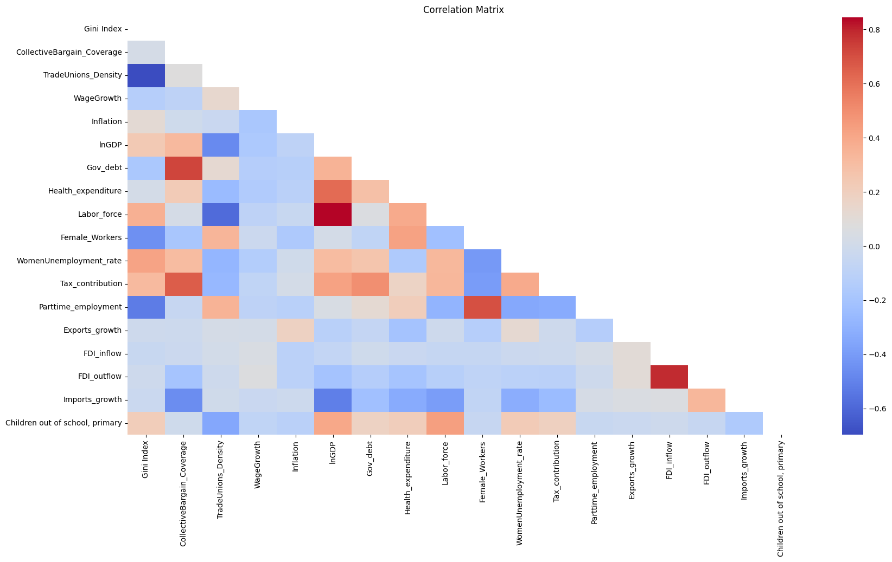

## 1. Research Question:
The following project aims to analyse the impact of Trade Unions Coverage on Income Inequality, over the past 20 year in EU countries. For this research the selected countries are: Austria, Belgium, Denmark, Finland, France, Germany, Italy, Luxembourg, Netherlands, Norway, Portugal, Spain and, Sweden.
With this in mind, particular focus must be placed on two fundamental research variables: the Coverage and the Density of labor unions. Collective Bargaining Coverage, according to ILO, explains the number of workers whose pay and/or conditions of employment is determined by one or more collective agreement(s). On the other side, Trade Union Density is the ratio of wage and salary earners that are trade union members to the total number of wage and salary earners in the economy. According to the Eurofund, net trade union density rates take into account only those union members that are employed; it therefore excludes union members that are retired, unemployed or student members.
Beginning in the early 1980s, trade union membership across many EU Member States has seen a downward trend, primarily because an increasing number of workers are opting out of joining trade unions. A significant factor behind this drop in membership numbers is the rise of non-standard employment types. Unlike union membership rates, changes in trade union density rates are generally more consistent, reflecting broader labor market trends. For example, during the recent economic downturn, the decrease in union density decelerated as a result of a significant reduction in employment levels.

Research in economics indicates that collective bargaining significantly contributes to the equalization of earnings. Studies commonly show that increased rates of collective bargaining coverage are associated with decreased income disparity. Moreover, nations with more centralized bargaining processes usually experience a smaller wage disparity between the lower and upper ends of the wage spectrum. This correlation is evidenced by wage distribution metrics, like the ratio of the 90th to the 10th percentile of earnings. Typically, countries with extensive collective bargaining coverage, especially those that engage in multi-employer negotiations at the inter-professional or sectoral level, demonstrate reduced earnings inequality according to this measure.

## Variables used
- Monthly Minimum Wage:
- WageGrowth: the Variable analise the average gross annual wage growth per full-time employment.
- Inflation: 
- Gini Index
- Female_Workers
- WomenUnemployment_rate
- Gov_debt
- Children out of school, primary
- Health_expenditure
- Exports_growth, FDI_inflow, FDI_outflow, Imports_growth
- Labor_force
- Tax_contribution
- Parttime_employment
- GDP 

## Correlation between variables

### The dataset contains several variables for different countries and years, including:

- Country and Year: Identifiers for the observations.
- Collective Bargain Coverage and Trade Unions Density: Key variables related to collective bargaining.
- Gini Index: A measure of income inequality.
- Economic indicators: Such as "Real Average Annual Wage Growth" and "Annual Inflation CPI".
- Labor market indicators: Including "Employment/population ratio Women age 15 to 64", "Labour force participation rate (Women age 15 to 64)", "Unemployment rate (Women age 15 to 64)", and others related to exports, imports, foreign direct investment, and part-time employment.

### Based on these variables, let's categorize them for the causal map:

- Collective Bargaining Variables: Collective Bargain Coverage, Trade Unions Density.
- Income Inequality Variables: Gini Index.
- Economic Variables: Real Average Annual Wage Growth, Annual Inflation CPI, Exports of goods and services (annual % growth), Foreign direct investment (net inflows and outflows as % of GDP), Imports of goods and services (% of GDP).
- Labor Market Variables: Employment/population ratio, Labour force participation rate, Unemployment rate, Labor force total, Labor tax and contributions (% of commercial profits), Part time employment, total (% of total employment).
